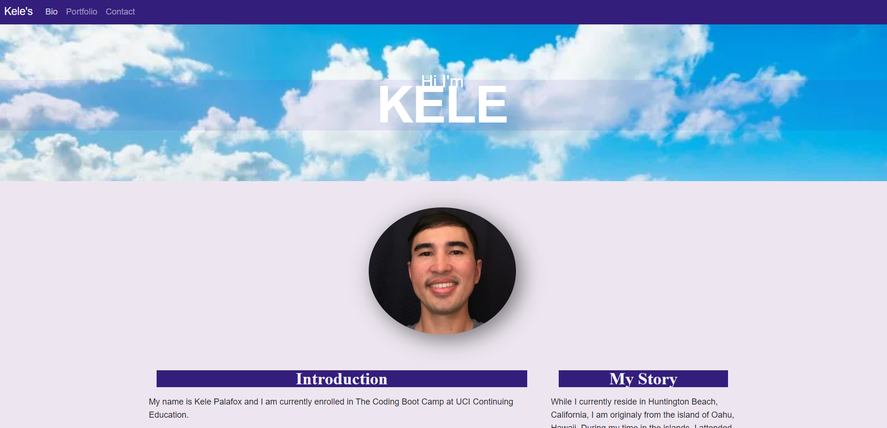

# Kele's React Portfolio

ABOUT:

This is my current portfolio which includes a personal biography, information about my current works, and contact information. The bio page provides a visitor with the chance to get to know me better. Here, answers for common questions and a brief personal narative are provided.

PLEASE NOTE:

Currently, a workaround is used to deploy this frontend react router application to GitHub. One characteristic worth mentioning is the full rendering of the portfolio only becomes available after a page link is clicked on the initial page that loads. Before this click event, the home page will render only partially. Full functionality should be available after this step.

Thank you for your patience and understanding,

Kele

FEATURES:

Current portfolio content created using React

Mobile-first design

Bootstrap aesthetics

CONTENT:

A personal biography

Links to my GitHub profile & LinkedIn page as well as your email address and phone number

A link to a PDF of my resume with updated projects

A list of projects, including the following information:

  1. Project title

  2. Links to deployed applications

  3. Links to project GitHub repositories

TECHNOLOGY USED:

React,

React Router,

Bootstrap,

HTML,

CSS,

GitHub,

Visual Studio Code,

VISIT: <a href="https://foxk2p.github.io/KeleP-React-Portfolio/" target="_blank">My Portfolio</a>

